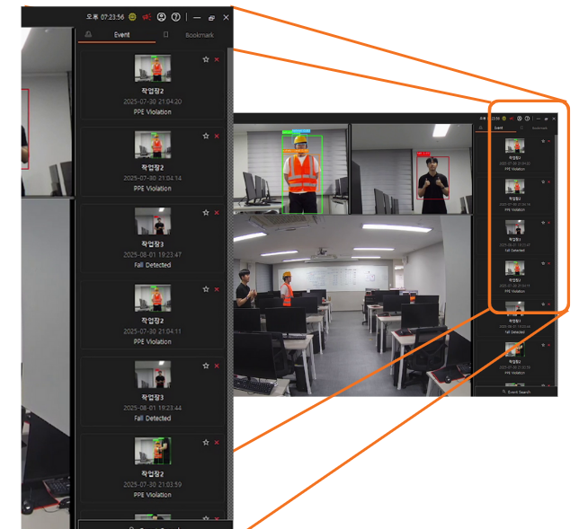

# Client_v3

## 버전 3 주요 개선사항

###  **카메라 관리 시스템 개선**
- **카메라 검증 시스템 강화**: 등록 시 자동 연결 상태 및 스트림 유효성 검사
- **드래그 앤 드롭 기능**: 카메라 슬롯 간 자유로운 위치 변경
- **전체화면 모드**: 개별 카메라 전체화면 보기 기능 추가
- **카메라 모드 변경**: Raw/Processed 모드 실시간 전환

###  **이벤트 검색 및 분석 시스템 신규 추가**
- **고급 검색 기능**: 카메라별, 이벤트 타입별, 날짜/시간별 필터링
- **드래그 앤 드롭 이미지 로드**: 외부 이미지 파일을 직접 드래그하여 분석
- **이미지 향상 기능 고도화**: 
  - 샤프닝 및 대비 조절 (OpenCV 기반)
  - CLAHE(Contrast Limited Adaptive Histogram Equalization) 적용
  - 실시간 이미지 처리 및 미리보기

###  **시스템 모니터링 시스템 신규 추가**
- **통합 시스템 모니터**: 모든 카메라의 시스템 상태 통합 표시
- **실시간 성능 지표**: CPU, 메모리 사용률 실시간 업데이트
- **웹소켓 기반 모니터링**: 실시간 시스템 정보 수신 및 표시

###  **알림 시스템 개선**
- **연속 감지 알림**: 20초 내 4번 연속 감지 시 특별 팝업 창
- **실시간 알림 패널**: 우측 상단 알림 목록 표시
- **북마크 기능**: 중요 이벤트를 북마크로 저장 및 관리

###  **웹소켓 통신 시스템 신규 추가**
- **실시간 양방향 통신**: 카메라 서버와의 WebSocket 연결
- **헬스체크 시스템**: 카메라 연결 상태 자동 감지 및 표시
- **실시간 이벤트 전송**: 서버로부터 실시간 이벤트 데이터 수신

###  **사용자 인터페이스 대폭 개선**
- **다크 테마 적용**: 일관된 다크 모드 UI 디자인
- **커스텀 탭바**: 드래그 가능한 탭 인터페이스
- **반응형 레이아웃**: 다양한 화면 크기에 대응
- **드래그 가능한 창**: 모든 다이얼로그 창 드래그 지원
- **심리스 UI**: 프레임 없는 창 디자인

###  **기술 스택 업그레이드**
- **Qt 6 마이그레이션**: 최신 Qt 프레임워크 적용
- **OpenCV 통합**: 이미지 처리 및 향상 기능
- **CMake 빌드 시스템**: 현대적인 빌드 시스템 적용

###  **성능 및 안정성 개선**
- **메모리 관리 최적화**: 효율적인 리소스 관리
- **에러 처리 강화**: 안정적인 예외 처리
- **실시간 성능 향상**: 부드러운 비디오 스트리밍

---

## 주요 기능

###  카메라 관리

  

- 실시간 CCTV 스트리밍 (RTSP/RTSPS)
- 다중 카메라 동시 모니터링
- 카메라 등록/편집/삭제
- 드래그 앤 드롭 카메라 배치

###  이벤트 감지

  

- PPE 위반 감지 (안전모, 안전조끼)
- 침입 감지
- 낙상 감지
- 이상 소음 감지

###  시스템 모니터링

  

- 실시간 CPU/메모리 사용률
- 카메라 연결 상태 모니터링
- 웹소켓 기반 실시간 통신

###  이미지 분석

  

- 고급 이미지 향상 기능
- 드래그 앤 드롭 이미지 로드
- 실시간 이미지 처리

###  알림 시스템

  

- 실시간 이벤트 알림
- 연속 감지 팝업
- 북마크 기능

---

## 시스템 요구사항

- Windows 10/11
- Qt 6.0 이상
- OpenCV 4.x
- 최소 4GB RAM
- 네트워크 연결

---